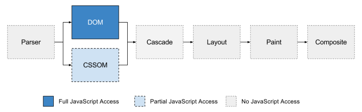
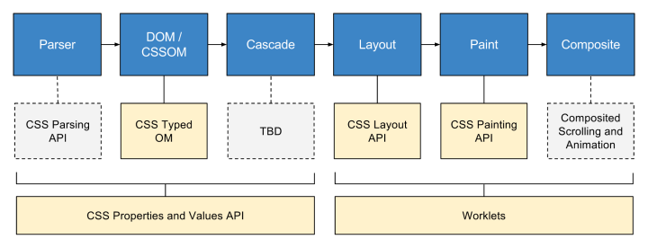

# CSS HOUDINI

<!-- > The objective of the CSS-TAG Houdini Task Force (CSS Houdini) is to jointly develop features that explain the “magic” of Styling and Layout on the web. -->

# 前言

让我们来看看一个 HTML 文档从被浏览器接收到显示在屏幕上的全过程，下面这张图里被标为蓝色的部分就是 JavaScript 可以染指的环节了：



我们根本控制不了浏览器解析 HTML 和 CSS 的过程，只能看着它生成 DOM 和 CSS object model (CSSOM)。没法控制级联（cascade）、没法控制浏览器布局元素的方式（layout）、也没法控制元素在屏幕上显示的过程（paint）、最后的合成（composite）也无能为力。
整个过程中，开发者能完全控制的唯一环节就是 DOM，另外 CSSOM 也可以部分控制到。即使如此，引用 Houdini 官网上的话来说，这种程度的暴露是“不确定的、兼容性不稳定的以及缺乏对关键特性的支持的”。

举个例子，浏览器中的 CSSOM 是不会告诉你它是如何处理跨源的样式表的，而且对于浏览器无法解析的 CSS 语句它的处理方式就是不解析了，也就是说——如果你要用 CSS polyfill 让浏览器去支持它尚且不支持的属性，那就不能在 CSSOM 这个环节做，只能自行解析一遍 DOM 树，找到 `<style>` 和 `<link rel="stylesheet">` 标签，获取其中的 CSS 样式、解析、重写，最后再加回 DOM 树中。

如果你想要浏览器做出它本来做不到事情（比如让它解析你给的样式，不管它能不能实现该样式），而渲染流程里你无法插手其他步骤，所以只能通过手动更新和改变 DOM 的方式。

“干涉”浏览器解析样式的目的:
- 统一跨浏览器行为
- 开发新特性或者给新特性打补丁，让人们可以立刻使用到新特性

# CSS Houdini

__CSS-TAG Houdini Task Force (CSS Houdini)__ 是W3C和各大厂商组成的一个工作组，志在建立一系列的API，让开发者能够介入浏览器的CSS引擎操作。

Houdini让开发者可以直接访问CSS对象模型(CSSOM),开发人员可以编写浏览器理解并可以解析为CSS的代码，（从而创建新的CSS功能，而无需等待它们在浏览器中本机实现。）而不是在Javascript中更新样式。

Much like Service Workers are a low-level JavaScript API for the browser's cache, *Houdini introduces low-level JavaScript APIs for the browser's render engines*

下面这张图片展示的是每个环节对应的新标准，开发者可以用这些标准来控制对应的环节。


包括：

- **Paint API**: Deals with background-image and background-border as CSS attributes, giving you the ability to draw in a canvas style on these images.
- **Typed OM API**: We have all had to deal with splitting up strings to remove the ‘px’ so that we can get an integer value of a style. Typed OM takes care of all these values with this object-based API for working with CSS values in JavaScript.
- **Properties & Values API**: Provides an API for defining CSS properties and giving them a type, behavior and default value. Very useful when paired with other APIs in this collection.
- **AnimationWorklet**: This will solve the messy solution of watching for events such as scrolling and mouse movement inside the same thread that your UI is running. Enhancing user experience in a nifty API.
- **Layout API**: Build your own layouts, reinvent flexbox and grid and implement it all with one CSS style added.
- **Parser API**: Make your own DOM element types such as `<color>` and have them do whatever you want to their children.
- **Font Metrics API**: Exposing some font data to you in a digestible form which give you a lot more control over text in your application.

## Is Houdini ready yet?

<https://ishoudinireadyyet.com/>

## Worklet

> The Worklet interface is a lightweight version of Web Workers and gives developers access to low-level parts of the rendering pipeline. With Worklets, you can run JavaScript and WebAssembly code to do graphics rendering or audio processing where high performance is required.

Worklets are JavaScript modules, added by invoking the worklet's addModule function, which is a Promise.

```javascript
// From inside the browser's context
await demoWorklet.addModule('path/to/script.js');

// Multiple worklets can be loaded at once, as well
Promise.all([
  demoWorklet1.addModule('script1.js'),
  demoWorklet2.addModule('script2.js'),
]).then(results => {
  // Both worklets have loaded, and we can do tasks that rely on them
});
```

```javascript
// The kind of worklet it is
registerDemoWorklet('name', class { // The name we'll call this worklet

  // Each worklet can define different functions to be used
  // These will be called by the render engine as needed
  process(arg) {
    // Stuff happens in here! What happens depends on the worklet
    // Sometimes it'll return something
    // Other times it'll work directly on the arguments
    return !arg;
  }
});
```

### Worklet types:

- PaintWorklet
- AnimationWorklet
- LayoutWorklet

## Typed OM

### 面临的问题

```javascript
const el = document.getElementById('el')

const opacity = window.getComputedStyle(el).opacity

typeof opacity === 'string' // true

el.style.opacity = 0.2
el.style.opacity += 0.1
// "0.20.1"   ???
```

Typed OM通过给CSS值添加类型、方法和适当的对象模型来进行扩展。值不再是字符串，而是作为 JavaScript 对象的值，用于提升 CSS 的性能和更加合理的操作。

在Typed OM中，CSS值都是 `CSSStyleValue` 基类中的成员，基类下有许多子类可以更详细的描述CSS值，包括：

<!-- > - `CSSPositionValue` : Position (x and y) values（好像没有这个了） -->
> - `CSSKeywordValue` : CSS Keywords and other identifiers (like inherit or grid)
> - `CSSImageValue` : An object representing the value properties for an image
> - `CSSUnitValue` : Numeric values that can be expressed as a single value with single unit (like 50px) or a single value or percentage without a unit
> - `CSSMathValue` : Complicated numeric values, like you would find with calc, min, and max. This includes subclasses CSSMathSum, CSSMathProduct, CSSMathMin, CSSMathMax, CSSMathNegate, and CSSMathInvert
> - `CSSTransformValue` : A list of CSS transforms consisting of CSSTransformComponents, including CSSTranslate, CSSRotate, CSSScale, CSSSkew, CSSSkewX, CSSSkewY, CSSPerspective, and/or CSSMatrixComponent
> - `CSSUnparsedValue` : CSSUnparsedValue objects represent property values that reference custom properties.

### 可用性检测方法

```javascript
window.CSS && CSS.number
```

### CSS 数值

数字由 Typed OM 中 CSSNumericValue 对象的两种类型来表示：

- `CSSUnitValue` - 包含单个单位类型（例如 "42px"）的值
- `CSSMathValue` - 包含多个值/单位的值，如数学表达式（例如 "calc(56em + 10%)"）

```javascript
// 单位值
const {value, unit} = CSS.number('10');
// value === 10, unit === 'number'

const {value, unit} = CSS.px(42);
// value === 42, unit === 'px'

const {value, unit} = CSS.vw('100');
// value === 100, unit === 'vw'

const {value, unit} = CSS.percent('10');
// value === 10, unit === 'percent'

const {value, unit} = CSS.deg(45);
// value === 45, unit === 'deg'

const {value, unit} = CSS.ms(300);
// value === 300, unit === 'ms'


// 数学值
new CSSMathSum(CSS.vw(100), CSS.px(-10)).toString(); // "calc(100vw + -10px)"

new CSSMathNegate(CSS.px(42)).toString() // "calc(-42px)"

new CSSMathInvert(CSS.s(10)).toString() // "calc(1 / 10s)"

new CSSMathProduct(CSS.deg(90), CSS.number(Math.PI/180)).toString();
// "calc(90deg * 0.0174533)"

new CSSMathMin(CSS.percent(80), CSS.px(12)).toString(); // "min(80%, 12px)"

new CSSMathMax(CSS.percent(80), CSS.px(12)).toString(); // "max(80%, 12px)"
```

### 获取和设置Typed OM值

- `attributeStyleMap` : 用于获取和设置内联样式
- `computedStyleMap` : 获取元素的完整Typed OM样式

#### attributeStyleMap Get and Set

```javascript
el.attributeStyleMap.set('font-size', CSS.em(2));
el.attributeStyleMap.get('font-size');
// CSSUnitValue { value: 2, unit: 'em' }

el.attributeStyleMap.set('opacity', CSS.number(.5));
el.attributeStyleMap.get('opacity');
// CSSUnitValue { value: 0.5, unit: 'number' };
```

#### computedStyleMap Output

```javascript
// css
.el {
  vertical-align: baseline;
  width: calc(100% - 3em);
}

// js
const cs = $('.foo').computedStyleMap();

cs.get('vertical-align');
// CSSKeywordValue {
//  value: 'baseline',
// }

cs.get('width');
// CSSMathSum {
//   operator: 'sum',
//   values: CSSNumericArray {
//     0: CSSUnitValue { value: -90, unit: 'px' },
//     1: CSSUnitValue { value: 100, unit: 'percent' },
//     length: 2
//   },
// }
```

### 优点

- 更少的bug。例如数字值总是以数字形式返回，而不是字符串。
- 算术运算和单位转换。在绝对长度单位（例如 px -> cm）之间进行转换并进行基本的数学运算。

  ```javascript
  // Convert px to other absolute/physical lengths.
  el.attributeStyleMap.set('width', '500px');
  const width = el.attributeStyleMap.get('width');
  width.to('mm'); // CSSUnitValue {value: 132.29166666666669, unit: "mm"}
  width.to('cm'); // CSSUnitValue {value: 13.229166666666668, unit: "cm"}
  width.to('in'); // CSSUnitValue {value: 5.208333333333333, unit: "in"}

  CSS.deg(200).to('rad').value // "3.49066rad"
  CSS.s(2).to('ms').value // 2000
  ```

- 数值范围限制和舍入。Typed OM 通过对值进行范围限制和舍入，以使其在属性的可接受范围内。
- 更好的性能。浏览器必须做更少的工作序列化和反序列化字符串值。
- 错误处理。新的解析方法带来了 CSS 世界中的错误处理。

  ```javascript
  // 检查 CSS 解析器是否符合 transform 值
  try {
    const css = CSSStyleValue.parse('transform', 'translate4d(bogus value)');
      // use css
  } catch (err) {
    console.log(err);
  }
  ```

- “我应该使用骆驼式的 CSS 名称还是字符串呢？” 你不再需要猜测名字是骆驼还或字符串（例如 el.style.backgroundColor vs el.style['background-color']）。Typed OM 中的 CSS 属性名称始终是字符串，与您实际在 CSS 中编写的内容一致:)

减少错误、提升性能。

## Custom Properties

### CSS变量

```CSS
  :root {
    --num: 10;
    --content: 'content';
    --length: 100px;
  }
  .class {
    width: calc(var(--num) * 1px);
    height: var(--length);
  }
  .class:after {
    content: var(--content);
  }

/* 问题 */
/* Current Situation (CSS Variables) */
.thing {
  --my-color: green;
  --my-color: url('not-a-color'); // It's just a variable! It doesn't know any better
  color: var(--my-color); // This is now sad!
}
```

### CSS自定义属性和自定义变量有什么区别？

实际上，CSS自定义属性和CSS变量之间没有区别，CSS自定义属性被 `var()` 调用的时候，它就从CSS自定义属性变成了CSS变量。但CSS中的自定义属性和CSS Houdini中的CSS自定义属性在声明的时候有明显的差异，在CSS Houdini中使用 `CSS.registerProperty` 来声明一个自定义属性，你还能更好的控制它。因为这样声明的CSS自定义属性，你可以给自定义属性分配**CSS类型**、**设置初始值**和**继承**。

### 注册自定义属性

```javascript
if ('registerProperty' in CSS ) {
  CSS.registerProperty({
    name: '--foo', // String, name of the custom property
    syntax: '<color>', // String, how to parse this property. Defaults to *
    inherits: false, // Boolean, if true should inherit down the DOM tree
    initialValue: 'black', // String, initial value of this property
  });
}
```

There are a number of supported syntaxes from the CSS Values and Units spec that can be used when registering a Custom Property:

- `<length>` - Any valid length value
- `<number>` - Any valid number value
- `<percentage>` - Any valid percentage value
- `<length-percentage>` - Any valid length or percentage value, or any calc expression combining length and percentage components
- `<color>` - Any valid color value
- `<image>` - Any Any valid image value
- `<url>` - Any valid url value
- `<integer>` - Any valid integer value
- `<angle>` - Any valid angle value
- `<time>` - Any valid time value
- `<resolution>` - Any valid resolution value
- `<transform-list>` - Any valid transform function value
- `<custom-ident>` - Any valid ident value

You can also use `+` to allow for a space-separarted list of one or more items of that syntax, and separate syntaxes with `|` to allow one syntax or another

## Paint API

The *CSS Painting API Level 1*, also known as the Houdini PAINT API, gives us a new option for places where we would use images in CSS: backgrounds, masks, and the like. With the new `paint()` function, and a PAINT API worklet, we can:

- Use a 2D Canvas-like drawing context to draw
- Scale our drawn image based on the size of the element (and redraw too)
- Style our drawing using *Custom Properties*

### 使用

```CSS
/* CSS */
.box {
    width: 180px;
    height: 180px;
    background-image: paint(sample-paint);
}
```

```javascript
// js
if (window.CSS) {
  CSS.paintWorklet.addModule('paint-worklet.js');
}
```

```javascript
// paint-worklet.js

registerPaint('sample-paint', class {
  // Custom properties from element's style to look for
  static get inputProperties() { return ['--foo']; }
  // Input arguments that can be passed to the `paint` function
  static get inputArguments() { return ['<color>']; }

  paint(ctx, size, props, args) {
    // ctx - drawing context
    // size - size of the box being painted
    // props - inputProperties
    // args - array of passed-in arguments

    // Paint code goes here.
  }
});
```

### PAINT API Polyfill
Start using the PAINT API today! Google Chrome Labs maintains a [polyfill](https://github.com/GoogleChromeLabs/css-paint-polyfill) for the PAINT API which makes it available in all browsers that support Canvas!

### 适用场景

CSS Paint API更适用于动态场景，适合实现需要实时绘制渲染的需求。如果是纯静态展示，直接就用JS加Canvas实现得了，没必要为了技术而技术。

## Animation API

The Animation Worklet API provides a method to create scripted animations that control a set of animation effects. The API is designed to make it possible for user agents to run such animations in their own dedicated thread to provide a degree of performance isolation from main thread.

Animation Worklet allows you to write imperative animations that run at the device's native frame rate for that extra buttery jank-free smoothness™, make your animations more resilient against main thread jank and are linkable to scroll instead of time.

Worklet Overview
```javascript
registerAnimator('sample-animator', class {
  constructor(options) {
    // Called when a new animator is instantiated
    // Used to set stuff up for each use of an animator
  }
  animate(currentTime, effect) {
    // currentTime - The current time from the defined timeline
    // effect - Group of effects that this animation is working on

    // Animation frame logic goes here.
    // Usually something to the effect of setting the time of an effect
    effect.localTime = currentTime;
  }
});
```

Register and Use Worklet from Main JavaScript

```javascript
await CSS.animationWorklet.addModule('path/to/animation-worklet.js');

// Element we want to animate
const elem = document.querySelector('#my-elem');
// The element we want to watch the scrolling on
const scrollSource = document.scrollingElement;
// Number of steps our animation will be broken up in to
const timeRange = 1000;
 // A new ScrollTimeline to use! Listen to scroll on the `scrollSource`, divide everything in to `timeRage` pieces, optionally start at `startScrollOffset` and end at `endScrollOffset`
const scrollTimeline = new ScrollTimeline({
  scrollSource,
  timeRange,
});

const effectKeyframes = new KeyframeEffect(
  elem,
  // The Keyframe animation effects we want to apply
  [
    {transform: 'scale(1)'},
    {transform: 'scale(.25)'},
    {transform: 'scale(1)'}
  ],
  {
    // The duration of the effect. If set to `timeRange` it will be a 1:1 movement with the scroll of the element, 0-`timeRange` will be faster, >`timeRage` will be slower, and 0 will be off
    duration: timeRange,
  },
);

// Create a new WorkletAnimation
new WorkletAnimation(
  // Name of the Animation Worklet to use
  'sample-animator',
  // Effect(s) to use. Can be an array of KeyframeEffects
  effectKeyframes,
  // Timeline to use for the Worklet
  scrollTimeline,
  // Options to pass in to Animation Worklet constructor
  {},
).play(); // Make It So
```

## Layout API

 The layout worklet is supposed to enable you to do display: layout('myLayout') and run your JavaScript to arrange a node’s children in the node’s box.

## CONCLUSION

- Advantage
  - Faster parse times for complex styles (since the styling is happening at the CSS step)
  - Developers no longer need to wait for web browser vendors to add CSS functionality — they can just polyfill it (this would happen when all browsers support Houdini — each Houdini worklet could then work interchangeably between browsers, like CSS plugins)
  - Polyfills are more performant, so pages will render faster
  - Better separation of logic and style (style kept in CSS, logic kept in JS)
  - More customized styles and design systems (since this approach allows us to add in styles that we can’t create with CSS today, as well as allows us to create default values and fallbacks in visual systems)

## REFERENCE

- Houdini
  - <https://imweb.io/topic/5be2f11221ff0e9610a66470>
  - <https://coalya.github.io/2018/08/01/houdni/>
  <!-- 下面两个里面有优缺点 -->
  - <https://blog.logrocket.com/new-horizons-in-css-houdini-and-the-paint-api-8b307cf387bb/>
  - <https://qianduan.group/posts/5ac9b45c9fd64d5a7458a8c1>
  - <https://developer.mozilla.org/en-US/docs/Web/Houdini>

- Worklet
  - <https://developer.mozilla.org/en-US/docs/Web/API/Worklet>

- Typed OM
  - <https://www.miaoroom.com/code/cssom-css-typed-om.html>
  - <https://developers.google.com/web/updates/2018/03/cssom>
  - <https://zhuanlan.zhihu.com/p/35029796>
  - <https://www.miaoroom.com/code/cssom-css-typed-om.html>
  - <https://drafts.css-houdini.org/css-typed-om/>
  - <https://houdini.glitch.me/typed-om>

- Custom Properties
  - <https://www.w3cplus.com/css/css-property-and-value-in-css-houdini.html>
  - <https://houdini.glitch.me/custom-properties>

- Paint API
  - <https://www.zhangxinxu.com/wordpress/2018/11/css-paint-api-canvas/>
  - <https://houdini.glitch.me/paint>

- Animation APi
  - <https://developers.google.com/web/updates/2018/10/animation-worklet>
  - <https://houdini.glitch.me/animation>

- Layout API
  - <https://houdini.glitch.me/layout>
  - <https://developers.google.com/web/updates/2016/05/houdini#layout_worklet>

- 例子
  - <https://css-houdini.rocks/>
  - <https://github.com/GoogleChromeLabs/houdini-samples>

<!-- The Dark Side of Polyfilling CSS
https://philipwalton.com/articles/the-dark-side-of-polyfilling-css/ -->
